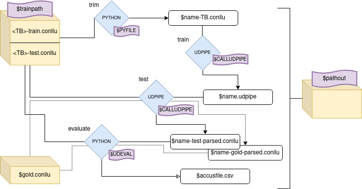

# Accuracies Pipeline
This repository consists of the basic scripts needed to compute accuracy between UD-Treebanks (TB), in terms of the accuracy that a parser trained on the TB attains when parsing a golden standard (as defined in the Master Thesis "Label Distribution in Dependency Treebanks and its Impact on the Quality of Trained Parsers" by Elena R. Raposo)

### Contents:
- `pipepine_gold.sh` : main script
- `trim_conllu.py` : auxiliary script used by the latter.
- `data_source/` : folder for storing source TB, (keeps everything neat).
    
- `data_aux/` : default folder for storing outputs.
    - `results.csv`: file to store results of each run of the pipeline. Contains a header with "name;corpus;size;gold;test_ud;gold_ud" as the results are stored in this fashion.

### Requisites
Uses gf-ud, udpipe and a python scripts.
- `gf-ud` is available at https://github.com/GrammaticalFramework/gf-ud
- `udpipe` is available at https://github.com/ufal/udpipe
- `conll17_ud_eval.py` is part of https://github.com/ufal/conll2017, a collection of python scripts made available for working with UD-treebanks. This file computes the LAS accuracy, as defined in CoNLL17 UD Shared Task evaluation metrics.

## `pipeline_gold.sh` script

Bash script that computes accuracy of a UD-Treebank, against a gold standard. The script trims, trains a udpipe parser, tests and evalutates the treebank against a gold standard.

### Requisites
Uses gf-ud, udpipe and two python scripts:
- `trim_conllu.py` is a Python script that trims treebanks to a required number of trees. It is part of this repo and it is documented below.
- `conll17_ud_eval.py` is part of https://github.com/ufal/conll2017, a collection of python scripts made available for working with UD-treebanks. This file computes the LAS accuracy, as defined in CoNLL17 UD Shared Task evaluation metrics.

### Preamble:
It needs adjusting the following paths and files:

- `PATHGF` : location of gf-ud folder.
- `CALLUDPIPE` : call to udpipe, can be only udpipe, or /src/udpipe, etc.
- `UDEVAL` : udpipe script for evaluation.
- `PYFILE` : location of `trim_goldenfile.py`, python file that trims conllu files.
- `PATHOUT` : where to store  output files.
- `ACCUFILE` : path to .csv file where accuracies are stored (appended).
- `GOLD_NAME_DEFAULT` and `GOLD_DEFAULT`: default gold treebank to use, name and location, respectively.

The last variable of the preamble is `NAME`, a common name for all intermediary and outputs created in the pipeline. It does not need to be changed, but it can be easily done.

### Usage
(from terminal, at this folder)
>`$ bash pipeline_gold.sh <corpus> <train> <N> (<gold_name> <gold>)`

- `<corpus>` : given name for the corpus.
- `<train>` : train-file of corpus. test-file should be in the same location with matching name (e.g sometb-train.conllu and sometb-test.conllu).
- `<N>` : wanted size (number of trees) of treebank.
- `(<gold_name>)` and `(<gold>)` : (optional) name and path of gold treebank to compare against. If none, uses default, as specified above.

### Examples of Use
> `$ bash pipeline_gold.sh gfwn data_source/wordnet-train.conllu 10`
>`#########################################
            --- Starting pipe with 10 trees, from corpus gfwn`

> `--- Results for corpus gfwn (auxfiles-gfwn_10`

> `acc UD on test = 30.09`

> `acc UD on gold = 8.32`

### Steps
To compute the accuracy of a TB, the pipeline needs to trim, train, test and evaluate. These steps are depicted in the following flow chart:

In each step there are auxiliary files produced, depicted in white and stored in `$PATHDATA`. These are:

- `$NAME_TB.conllu` : trimmed TB to be evaluated.
- `$NAME.udpipe` : parser trained on TB.
- `$NAME-test-parsed.conllu` and `$NAME-gold-parsed.conllu` : files as parsed by the `$NAME.udpipe`, the former is the test part of the TB, and the latter is the gold TB.
- `$ACCUFILE` : results are appended to this file. It is never overwritten.

## `trim_conllu.py` script
Simple script that selects N sentences from a conllu file. The selection could be ordered or random. Raises a warning if it's asked for more sentences than available.

Requires python package _conllu_ (https://pypi.org/project/conllu/)

Usage:
> `python3 trim_conllu.py <infile> <size> <outfile> (-r) (-s)`

- `infile` : input file.
- `size` :
- `outfile` : name to give output file. 
- `-r` or `--randomness` : whether to choose sentences randomly, default False.
- `-s` or `--splits`: whether to split file into train and test. Size becomes size of train, outfile name of train file. Default False.

